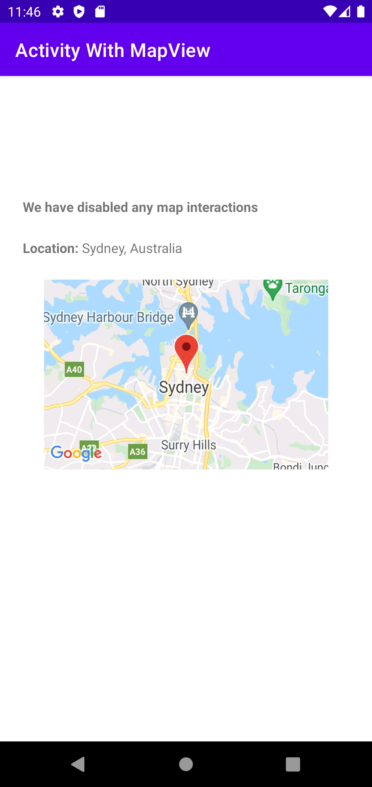

# android-lab

my personal Android lab for experimenting Android and Kotlin features.

### Screenshots

### Interest points

#### Non-fullscreen Google Map view

#### Disable all map interactions on Google map view, including:

- Scroll

- Zoom

- Rotate

- Tilt (What is tilt? [A demo video](https://www.youtube.com/watch?v=7nWf0WhJom8))

#### TextView with Html support

